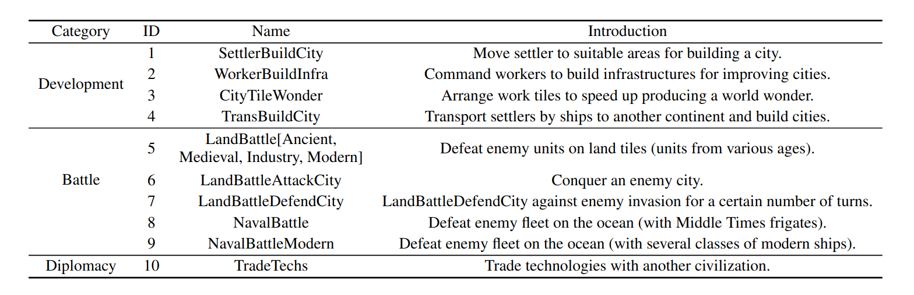
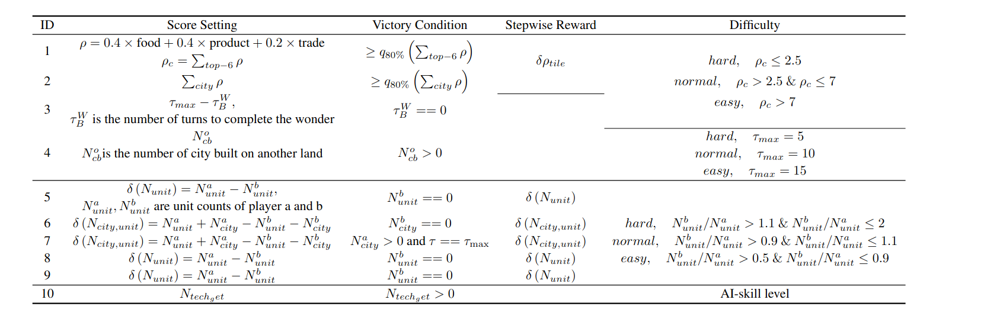
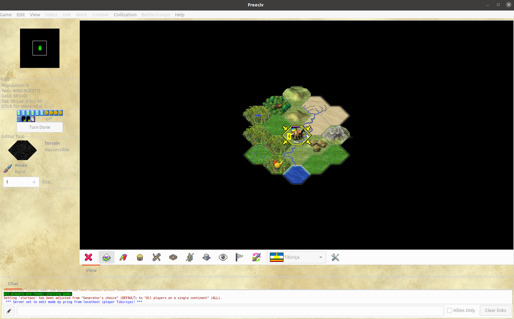
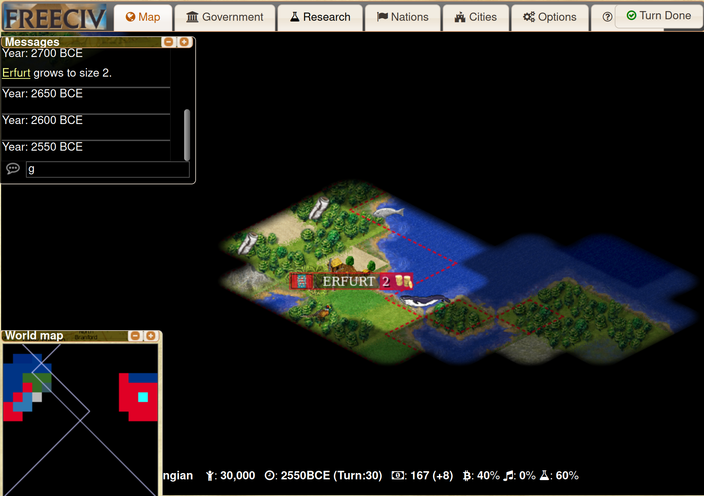
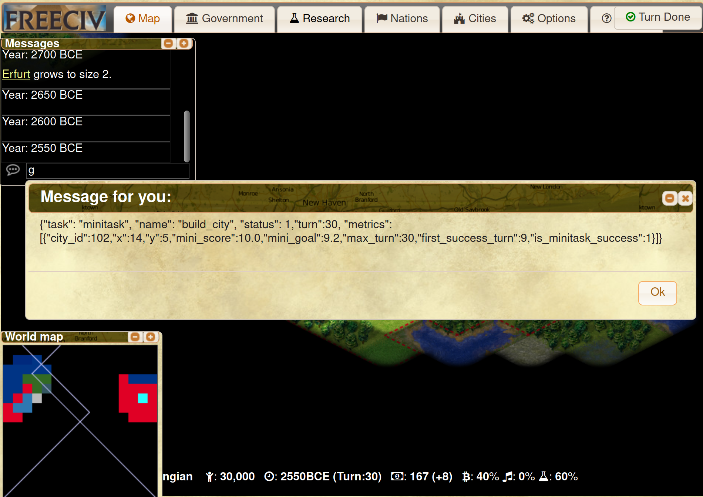
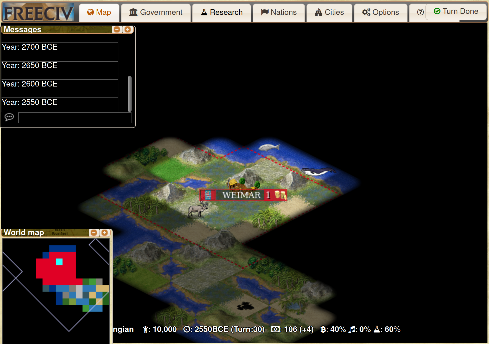
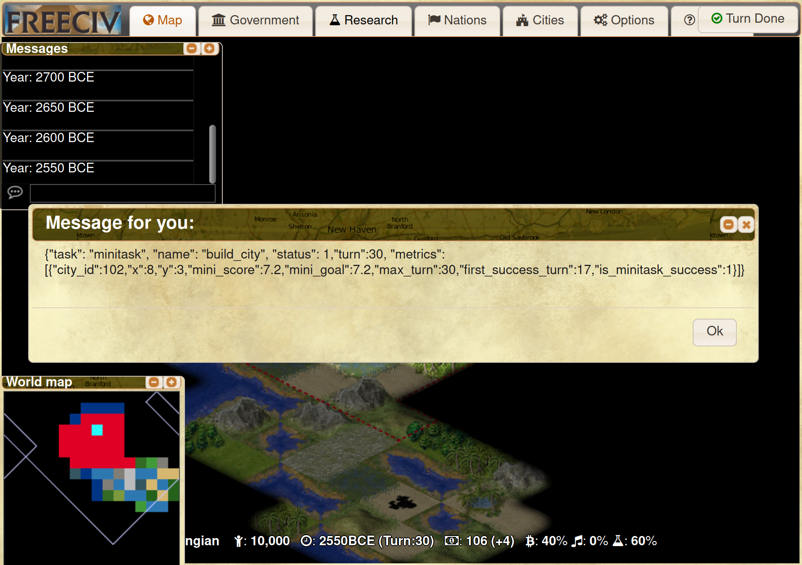
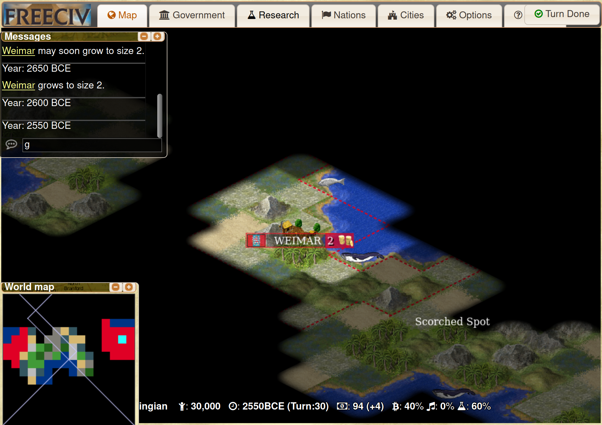
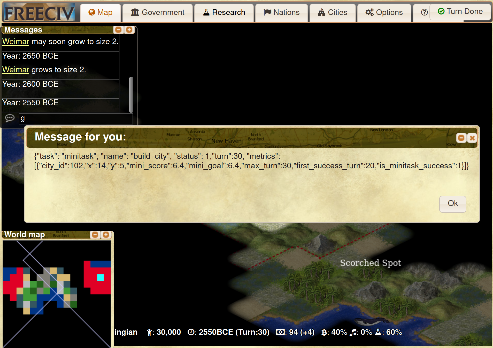

# CivRealm Mini-Game Creation

## Motivation

Code to create mini-games in CivRealm, including a Freeciv document file processing module, which reconstructs and analyzes sav files and adds, deletes, and modifies information. Its meaning includes
1. Based on the structural analysis of the stored documents, provide the information statistics of the current snapshot and historical snapshots, first detect the current behavior of the agent in the task, and the historical behavior index curve

2. Add, delete, and modify operations based on key information, and provide a rich initialization environment for different processes and tasks with responses (siege, renovation, city construction, etc.) under the condition of meeting the key constraints of the target, and further improve the agent's ability in local tasks Decision-making capacity

3. Based on a large amount of initialization environment and agent behavior index data, the impact of different initialization environments on agent behavior can be calculated, focusing on determining the difficulty of the initialization environment and the built-in strategy of the agent

## Installation

Installation for freeciv-sav users and developers

```
cd civrealm-sav
pip install -e .
```


## Minitask Generation

The basic design mechanisms of mini-game are:

* <b>Single Goal.</b> Don't consider multiple learning objectives at the same time, otherwise the game will become less mini after more influences are introduced.

* <b>Feasible Action.</b> In the huge space of action, be clear about which actions are relevant to your goal, and avoid too many unrelated or paradoxical actions in actionable actions.

* <b>Computable Reward.</b> In addition to the final score at the end of the game, the reward for each step or turn can be defined and calculated.

### Generate Minitask

Execute the generation task:

```
bash run-minitasks ${path of freeciv-sav} ${image_name} ${user_name} ${count_of_minigame} ${gen_mode}
```

The options of `user_name` are "minitask" and "testminitask". The former user name is used to train model. For example, when we need to test our trained model by 1000 different minitasks of online(see the config/minitask_config.py), we could generate the savs by command like

```
bash run-minitasks ~ freeciv-web testminitask 1000 online
```

Push to the shared mas path:

```
bash push-minitasks ${user_name}
```

### Definition




### Randomization

The purpose of randomization is to improve the model's ability to generalize on specific tasks and avoid remembering irrelevant information.

|             |             | unit|     |      |      | city|     |terrain|     |resources|   |tech | building|
| ----------- | ----------- | ----|-----| -----| -----| ----|-----| ----- |-----| ----- |-----|-----| --------|
|    type     | subtype     | loc | cnt | type | hp   | loc | size| type  | loc | type  | loc | loc | type    |
| development | buildcity   | √   |     |      |      |     |     |   √   |  √   |   √   |  √  |     |         |
|             | citytilewonder| √ |     |      |      |  √  |     |   √   |  √  |   √   |  √  |  √  |         |
|             | buildinfra  | √   | √   |      |      |  √  |     |   √   |  √  |   √   |  √  |     |         |
|             | transport   |  √  | √   |      |      |  √  |     |       |√    |       |     |     |         |
|   battle    | battle(split by 5 eras)| √ | √ | √|      |     |     |   √   |  √ |   √   |  √  |     |         |
|             | attackcity  | √   | √   |  √   |      |  √  |     |   √   |  √  |   √   |  √  |     |         |
|             | defendcity  | √   | √   |  √   |      |  √  |     |   √   |  √  |   √   |  √  |     |         |
|             | naval(split by 2 eras)|  √  |  √  |      |     |     |      |  √    |  √  |   √   |  √  |     |         |
|  diplomacy  | tradetech   |     |     |      |      |     |     |       |    |       |     |  √  |         |


### Control Points


### Agent Evaluations

|             |                        | random        |     tensor        |
| ----------- | -----------            | ----          |   --------------  |
| development | buildcity              |  EMH~30%             | E40%, M30%, H20%  |
|             | citytilewonder         |               |  EMH > 90%        |
|             | buildinfra             |               |                   |
|             | transport              |               |                   |
|   battle    | battle(split by 5 eras)|               |                   |
|             | attackcity             |               |                   |
|             | defendcity             |               |                   |
|             | naval(split by 2 eras) |               |                   |
|  diplomacy  | tradetech              |               |                   |


### Inner Metrics

|    metric   |  desc             |
| ----------- | ------------------|
| mini_score  | the score of minitask |
| mini_goal   | the goal of minitask |
| is_mini_success   | whether the player successed |
| status   | whether the game was over |


```

@unique
class MinitaskType(ExtendedEnum):
    MT_DEVELOPMENT_BUILD_CITY = "development_build_city"
    MT_DEVELOPMENT_CITYTILE_WONDER = "development_citytile_wonder"
    MT_DEVELOPMENT_BUILD_INFRA = "development_build_infra"
    MT_DEVELOPMENT_TRANSPORT = "development_transport"
    MT_BATTLE_ANCIENT = "battle_ancient_era"
    MT_BATTLE_INDUSTRY = "battle_industry_era"
    MT_BATTLE_INFO = "battle_info_era"
    MT_BATTLE_MEDIEVAL = "battle_medieval"
    MT_BATTLE_MODERN = "battle_modern_era"
    MT_BATTLE_NAVAL_MODERN = "battle_naval_modern"
    MT_BATTLE_NAVAL = "battle_naval"
    MT_BATTLE_ATTACK_CITY = "battle_attack_city"
    MT_BATTLE_DEFEND_CITY = "battle_defend_city"
    MT_DIPLOMACY_TRADE_TECH = "diplomacy_trade_tech"

@unique
class MinitaskGameStatus(ExtendedEnum):
    MGS_END_GAME = 1
    MGS_IN_GAME = 0

@unique
class MinitaskPlayerStatus(ExtendedEnum):
    MPS_SUCCESS = 1
    MPS_FAIL = 0
    MPS_UNKNOWN = -1

@unique
class MinitaskDifficulty(ExtendedEnum):
    MD_EASY = 'easy'
    MD_NORMAL = 'normal'
    MD_HARD = 'hard'

```

## Freeciv Original Gtk version for human operation



Install Reference: https://github.com/freeciv/freeciv/blob/main/INSTALL

Existing features:

1. City modification: support adding/deleting/scale

2. Map: Supports modification of elements, support for common positions and special positions, support for the addition of atomized areas

3. Technology: Modification is not supported

4. Unit: supports adding/deleting/modifying attributes/jumping into the sea/movable, does not support field of view editing, not sure if it can belong to a city

5. Resources: support adding/deleting

6. Roads: support adding/deleting

7. milltary: support adding/deleting

8. Game: support switching players for control, support freeciv-web document editing

Problem list:

1. Because editing is not supported, deleting and adding will bring changes to the id class, which will affect the realization of movement routes based on id or downstream functions that rely on id (need to change id)

2. Whether each change will fluctuate other elements

Examples:

1. buildcity:

(1) Easy



(2) Normal



(3) Hard



Edit Mode: Edit - Edit Mode
